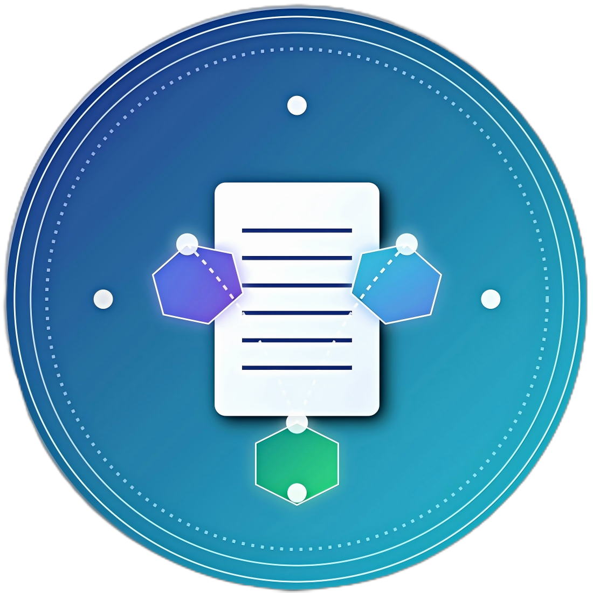

<div align="center">
  
</div>

# Blokdoc

A blockchain-based document verification and management system built on Solana.

## 🌟 Features

- Document storage on IPFS and Arweave
- Document verification through Solana blockchain
- Secure document sharing and access control
- Version control and document history
- User-friendly dashboard interface
- Multi-wallet support (Phantom, Solflare, Torus)
- Advanced document processing and content extraction
- Searchable document metadata and content
- Automated document classification using AI
- Collaborative editing and review workflows
- Document templating and form generation
- Custom approval workflows and digital signatures
- Advanced analytics and audit trails
- REST API for third-party integrations

## 🛠️ Technology Stack

- Frontend: React, Next.js, TailwindCSS
- Backend: Next.js API routes
- Blockchain: Solana
- Storage: IPFS, Arweave
- Authentication: NextAuth.js
- Document Processing: PDF.js
- AI/ML: TensorFlow.js for document classification
- WebAssembly for performance-critical operations

## 🏗️ Project Architecture

```
blokdoc/
├── contracts/           # Solana smart contracts
├── docs/                # Documentation
├── public/              # Static assets
├── src/
│   ├── blockchain/      # Blockchain integration
│   │   └── solana/      # Solana specific code
│   ├── components/      # React components
│   ├── pages/           # Next.js pages and API routes
│   │   ├── api/         # Backend API endpoints
│   │   └── ...          # Frontend pages
│   ├── services/        # Business logic services
│   │   ├── document/    # Document processing services
│   │   └── storage/     # Storage services (IPFS, Arweave)
│   ├── styles/          # CSS and styling
│   ├── types/           # TypeScript type definitions
│   └── utils/           # Utility functions
└── tests/               # Test files
```

## 📊 System Architecture

```
+-----------------+     +-----------------+     +------------------+
|                 |     |                 |     |                  |
|  Client Layer   |---->|    API Layer    |---->|  Service Layer   |
|  (Next.js/React)|     |  (Next.js API)  |     |  (Core Logic)    |
|                 |     |                 |     |                  |
+-----------------+     +-----------------+     +--------+---------+
                                                         |
                                                         v
                                           +--------------+-------------+
                                           |              |             |
                                           v              v             v
                               +----------------+ +-------------+ +------------+
                               |                | |             | |            |
                               | Blockchain     | | IPFS        | | Arweave    |
                               | (Solana)       | | Storage     | | Storage    |
                               |                | |             | |            |
                               +----------------+ +-------------+ +------------+
```

Blokdoc follows a multi-layered architecture:

1. **Frontend Layer** - React/Next.js application providing the user interface
2. **API Layer** - Next.js API routes handling backend logic
3. **Service Layer** - Core business logic for document processing
4. **Blockchain Layer** - Integration with Solana for document verification
5. **Storage Layer** - IPFS and Arweave for decentralized storage

## 💾 Data Flow

```
+-------------+    +-----------------+    +-------------------+
| User Upload |    | File Processing |    | Storage & Blockchain
+-------------+    +-----------------+    +-------------------+
       |                   |                        |
       v                   v                        v
+-------------+    +-----------------+    +-------------------+
| Select File |    | Validate & Scan |    | Upload to IPFS/   |
| Add Metadata|    | Extract Content |    | Arweave           |
+-------------+    +-----------------+    +-------------------+
       |                   |                        |
       v                   v                        v
+-------------+    +-----------------+    +-------------------+
| Submit Form |    | Generate Hash   |    | Register on Solana|
|             |    | Process Content |    | Store Reference   |
+-------------+    +-----------------+    +-------------------+
```

### Document Upload Process:

1. User selects a document and submits metadata
2. File is validated and scanned for viruses
3. Document content is processed and extracted
4. File is encrypted and uploaded to IPFS/Arweave
5. Document hash and metadata are registered on Solana blockchain
6. Document reference is stored in database with user ownership

### Document Verification Process:

1. User requests document verification
2. System retrieves document hash from blockchain
3. Original document hash is compared with blockchain record
4. Verification result is returned to user
5. Verification transaction is added to document history

## 💻 Key Code Implementations

### Blockchain Integration

```typescript
// Document verification on Solana
export const verifyDocumentOnChain = async (
  connection: Connection,
  wallet: any,
  documentHash: string,
  metadata: Record<string, any> = {}
): Promise<DocumentVerification | null> => {
  try {
    // Create a memo instruction with the document hash
    const encodedData = Buffer.from(
      JSON.stringify({
        type: 'document_verification',
        hash: documentHash,
        timestamp: Date.now(),
        metadata
      })
    );

    // Send transaction
    const instruction = new TransactionInstruction({
      keys: [
        { pubkey: wallet.publicKey, isSigner: true, isWritable: true }
      ],
      programId: new PublicKey('MemoSq4gqABAXKb96qnH8TysNcWxMyWCqXgDLGmfcHr'),
      data: encodedData
    });

    const transaction = new Transaction().add(instruction);
    const signature = await wallet.sendTransaction(transaction, connection);
    
    // Confirm transaction
    await connection.confirmTransaction(signature, 'confirmed');

    return {
      documentHash,
      timestamp: Date.now(),
      owner: wallet.publicKey.toString(),
      signature,
      transactionId: signature
    };
  } catch (error) {
    console.error('Error verifying document on chain:', error);
    return null;
  }
};
```

### File Processing

```typescript
export const processFileUpload = async (
  fileBuffer: Buffer,
  fileName: string,
  mimeType: string,
  size: number,
  uploadedBy: string
): Promise<UploadResult> => {
  try {
    // 1. Validate file size and type
    validateFileSize(size);
    validateFileType(fileName, mimeType);
    
    // 2. Scan for viruses
    const isSafe = await scanForViruses(fileBuffer);
    
    // 3. Calculate file hash for integrity
    const hash = await calculateFileHash(fileBuffer);
    
    // 4. Create file metadata
    const metadata = {
      originalName: fileName,
      size,
      mimeType,
      extension: fileName.split('.').pop()?.toLowerCase() || '',
      hash,
      uploadedBy,
      uploadedAt: new Date()
    };
    
    // 5. Store file in decentralized storage
    const storageLocation = await storeFile(fileBuffer, metadata);
    
    // 6. Create document record
    const document = {
      id: `doc-${Date.now()}-${Math.floor(Math.random() * 1000)}`,
      name: fileName,
      fileType: metadata.extension,
      fileSize: size,
      createdAt: metadata.uploadedAt,
      updatedAt: metadata.uploadedAt,
      storageInfo: {
        location: storageLocation,
        hash,
        originalName: fileName
      },
      owner: uploadedBy,
      version: 1,
      status: 'processing'
    };
    
    return { success: true, document, metadata, storageLocation };
  } catch (error) {
    // Handle errors
    return { 
      success: false, 
      error: error instanceof UploadError ? error : new UploadError(UploadErrorType.UPLOAD_FAILED, 'Unknown error') 
    };
  }
};
```

## 🔐 Security Features

Blokdoc implements several security measures:

- **File Validation**: Checks file size, type, and extension before processing
- **Virus Scanning**: All uploaded files are scanned for malware
- **Content Hashing**: SHA-256 hash verification for document integrity
- **Blockchain Verification**: Immutable proof of document existence and ownership
- **Access Control**: Fine-grained permission system for document sharing
- **Encryption**: Document content is encrypted before storage
- **Multi-factor Authentication**: Additional security layer for sensitive operations
- **Audit Logging**: Comprehensive activity tracking and anomaly detection
- **Security Headers**: Protection against common web vulnerabilities
- **Rate Limiting**: Prevention of brute force and DoS attacks

## 🚀 Getting Started

### Prerequisites

- Node.js 16+
- Solana CLI tools
- A Solana wallet (Phantom, Solflare, or similar)

### Installation

1. Clone the repository
   ```
   git clone https://github.com/Blokdoc/Blokdoc.git
   cd Blokdoc
   ```

2. Install dependencies
   ```
   npm install
   ```

3. Configure environment variables
   ```
   cp .env.example .env.local
   ```
   Edit `.env.local` with your Solana network settings

4. Run the development server
   ```
   npm run dev
   ```

## 🔍 Use Cases

Blokdoc is designed to serve a variety of document verification and management needs:

### Enterprise Document Management
- **Legal Contracts**: Securely store and verify legal agreements with immutable timestamps
- **Intellectual Property**: Register patents, trademarks, and copyright materials with blockchain proof
- **Compliance Documentation**: Maintain regulatory documents with verifiable audit trails

### Academic Credentials
- **Degree Certificates**: Issue and verify academic credentials
- **Research Publications**: Timestamp and verify authorship of research papers
- **Training Certifications**: Manage professional certifications with verifiable validity

### Government & Public Sector
- **Public Records**: Maintain transparent and tamper-proof public documents
- **Citizen Identity**: Secure personal identification documents
- **Land Registry**: Record property ownership with blockchain verification

### Healthcare
- **Medical Records**: Secure patient records with controlled access
- **Clinical Trial Documentation**: Ensure integrity of research documentation
- **Prescription Management**: Verify authenticity of medical prescriptions

### Financial Services
- **Insurance Policies**: Store and verify policy documents
- **Loan Agreements**: Manage lending documentation with verifiable timestamps
- **Audit Reports**: Maintain tamper-proof financial audit documentation

## 🏆 Comparison with Alternatives

| Feature | Blokdoc | Traditional DMS | Blockchain-only Solutions |
|---------|---------|----------------|---------------------------|
| Document Storage | Decentralized (IPFS/Arweave) | Centralized servers | On-chain (limited) |
| Verification | Blockchain-based | Digital signatures | Blockchain-based |
| Cost Efficiency | Low transaction fees (Solana) | Subscription-based | High gas fees (Ethereum) |
| Scalability | High-throughput | Limited by servers | Depends on blockchain |
| User Experience | Web3 + Traditional UI | Traditional UI | Complex Web3 UI |
| Privacy | Encrypted, controlled sharing | Access control | Public by default |
| Integration | API-first approach | Varies | Limited |
| Search Capabilities | Full-text + metadata | Full-text + metadata | Limited to metadata |
| Compliance Features | Built-in audit trails | Manual tracking | Transparent but basic |

## 🌍 Community and Contributions

Blokdoc is an open-source project that thrives on community contributions. We welcome developers, designers, testers, and documentation writers to join our mission of revolutionizing document management through blockchain technology.

### Ways to Contribute

- **Code Contributions**: Help improve the core platform or build new features
- **Documentation**: Enhance our guides and technical documentation
- **Testing**: Identify bugs and help improve platform stability
- **Translations**: Help make Blokdoc accessible in multiple languages
- **Feedback**: Share your experience and suggest improvements

### Development Principles

- **Security First**: Security is our top priority in all development decisions
- **User-Centered Design**: Focus on creating intuitive and accessible experiences
- **Performance**: Optimize for speed and efficiency
- **Modularity**: Build components that can be easily maintained and extended
- **Documentation**: Comprehensive documentation for all features and APIs

Join our community channels to get involved!

## 📘 Documentation

For detailed documentation, please see the [docs](./docs) directory.

## 🧪 Testing

Run the test suite:

```
npm test
```

For specific test files:

```
npm test -- src/services/document/upload.test.ts
```

## 🤝 Contributing

We welcome contributions! Please see our [Contributing Guide](CONTRIBUTING.md) for details.

## 📄 License

This project is licensed under the MIT License - see the [LICENSE](LICENSE) file for details.

## 📊 Project Status

Blokdoc is currently in Beta Release.

## 📱 Connect With Us

- **Website**: [https://www.blokdoc.xyz/](https://www.blokdoc.xyz/)
- **GitHub**: [https://github.com/Blokdoc/Blokdoc](https://github.com/Blokdoc/Blokdoc)
- **Twitter**: [https://x.com/Blok_doc_](https://x.com/Blok_doc_)

For any technical inquiries or bug reports, please open an issue on our [GitHub repository](https://github.com/Blokdoc/Blokdoc/issues). 